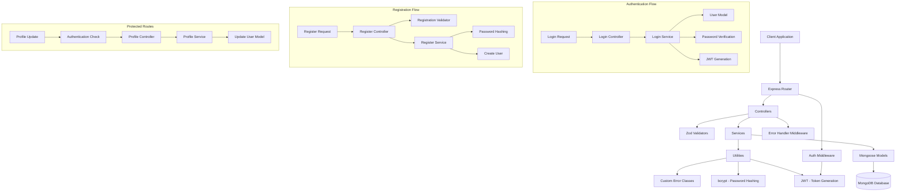
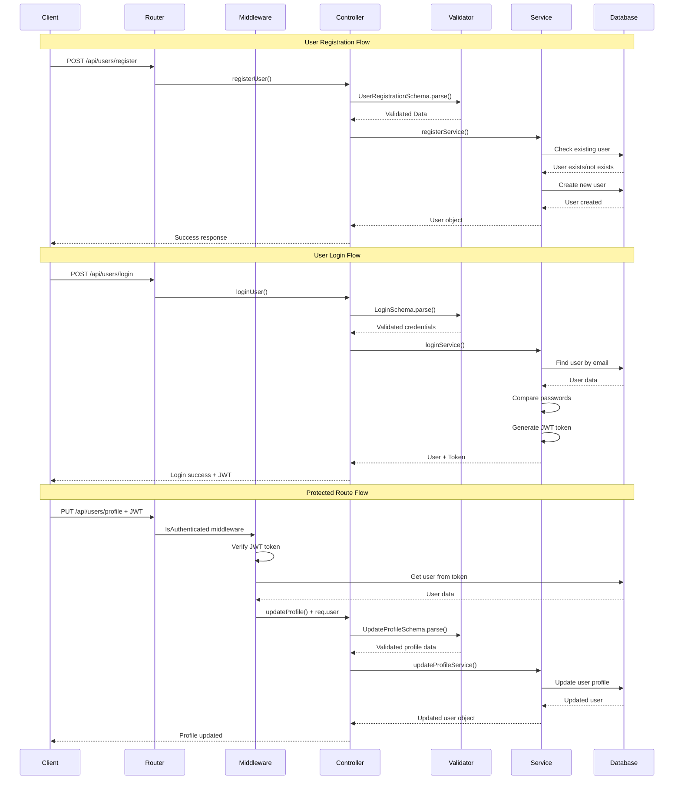
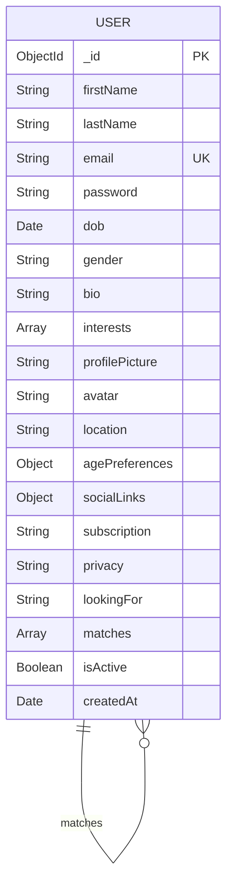

# Dating App Backend API

A Node.js/Express backend API for a dating application with user authentication, profile management, and matching functionality.

## Features

- User Registration & Authentication
- JWT-based Authorization
- Profile Management
- Password Security with bcrypt
- Input Validation with Zod
- MongoDB Database Integration
- Error Handling Middleware

## Tech Stack

- **Runtime**: Node.js
- **Framework**: Express.js
- **Database**: MongoDB with Mongoose
- **Authentication**: JWT (JSON Web Tokens)
- **Password Hashing**: bcrypt
- **Validation**: Zod
- **Environment**: dotenv

## Architecture Diagram



## API Flow Diagram



## Database Schema Diagram



### Schema Details

- **agePreferences**: `{ min: Number, max: Number }`
- **socialLinks**: `{ instagram, facebook, twitter, linkedin }`
- **subscription**: `"free" | "solara"`
- **privacy**: `"public" | "private"`
- **gender**: `"male" | "female" | "other"`
- **lookingFor**: `"friendship" | "relationship" | "casual" | "other"`
```

## Project Structure

```
backend/
├── config/
│   ├── database.config.js    # MongoDB connection
│   ├── env.config.js         # Environment variables
│   └── Https.config.js       # HTTP status codes
├── controllers/
│   └── user.controller.js    # User-related controllers
├── enums/
│   └── error-code.enum.js    # Error code enumerations
├── middlewares/
│   ├── AsyncHandler.middleware.js   # Async error handling
│   ├── Auth.middleware.js           # JWT authentication
│   └── ErrorHandler.middleware.js  # Global error handling
├── models/
│   └── user.model.js         # User database schema
├── routes/
│   └── user.route.js         # User API routes
├── services/
│   └── user.service.js       # Business logic
├── utils/
│   ├── AppError.js           # Custom error classes
│   ├── bcrypt.js             # Password hashing utilities
│   └── getEnv.util.js        # Environment utilities
├── validators/
│   └── user.validator.js     # Input validation schemas
├── index.js                  # Application entry point
└── package.json              # Dependencies and scripts
```

## API Endpoints

### Authentication

#### Register User
```http
POST /api/users/register
Content-Type: application/json

{
  "firstName": "John",
  "lastName": "Doe",
  "email": "john.doe@example.com",
  "password": "SecurePass123!"
}
```

#### Login User
```http
POST /api/users/login
Content-Type: application/json

{
  "email": "john.doe@example.com",
  "password": "SecurePass123!"
}
```

### Profile Management

#### Update Profile
```http
PUT /api/users/profile
Authorization: Bearer <jwt_token>
Content-Type: application/json

{
  "dob": "1995-03-15",
  "gender": "male",
  "bio": "Looking for meaningful connections",
  "interests": ["hiking", "photography", "cooking"],
  "location": "New York, NY",
  "agePreferences": {
    "min": 22,
    "max": 35
  },
  "socialLinks": {
    "instagram": "john_doe95",
    "twitter": "johndoe",
    "linkedin": "john-doe-profile"
  },
  "privacy": "public",
  "lookingFor": "relationship"
}
```

## User Schema

### Required Fields (Registration)
- `firstName` - String (2-50 characters)
- `lastName` - String (2-50 characters)
- `email` - Valid email address (unique)
- `password` - String (min 8 chars, must include uppercase, lowercase, number, special char)

### Optional Fields (Profile Update)
- `dob` - Date of birth
- `gender` - Enum: ['male', 'female', 'other']
- `bio` - String (max 500 characters)
- `interests` - Array of strings
- `profilePicture` - String (image URL)
- `avatar` - String (AI-generated avatar URL)
- `location` - String
- `agePreferences` - Object with min/max age (18-99)
- `socialLinks` - Object with social media profiles
- `subscription` - Enum: ['free', 'solara'] (default: 'free')
- `privacy` - Enum: ['public', 'private'] (default: 'public')
- `lookingFor` - Enum: ['friendship', 'relationship', 'casual', 'other']

### System Fields
- `matches` - Array of user IDs
- `isActive` - Boolean (default: true)
- `createdAt` - Timestamp

## Environment Variables

Create a `.env` file in the backend directory:

```env
NODE_ENV=development
PORT=5000
MONGO_URI=mongodb://localhost:27017/dating-app
JWT_SECRET=your-super-secret-jwt-key
JWT_EXPIRES_IN=7d
```

## Installation & Setup

1. **Clone the repository**
   ```bash
   git clone <repository-url>
   cd backend
   ```

2. **Install dependencies**
   ```bash
   npm install
   ```

3. **Set up environment variables**
   ```bash
   cp .env.example .env
   # Edit .env with your configuration
   ```

4. **Start MongoDB**
   ```bash
   # Make sure MongoDB is running on your system
   mongod
   ```

5. **Run the application**
   ```bash
   # Development mode
   npm run dev

   # Production mode
   npm start
   ```

## Password Requirements

The API enforces strong password policies:
- Minimum 8 characters
- At least one uppercase letter
- At least one lowercase letter
- At least one number
- At least one special character

## Error Handling

The API uses custom error classes and middleware for consistent error responses:

- `AppError` - Base error class
- `UnauthorizedException` - 401 errors
- `NotFoundException` - 404 errors
- `BadRequestException` - 400 errors
- `InternalServerException` - 500 errors

## Security Features

- JWT-based authentication
- Password hashing with bcrypt
- Input validation and sanitization
- Protected routes with authentication middleware
- Password field excluded from API responses

## Development

### Scripts
- `npm start` - Start production server
- `npm run dev` - Start development server with nodemon
- `npm test` - Run tests (if configured)

### Code Style
- ES6 modules
- Async/await pattern
- Consistent error handling
- Modular architecture

## Contributing

1. Fork the repository
2. Create a feature branch
3. Make your changes
4. Add tests if applicable
5. Submit a pull request

## License

This project is licensed under the MIT License.
